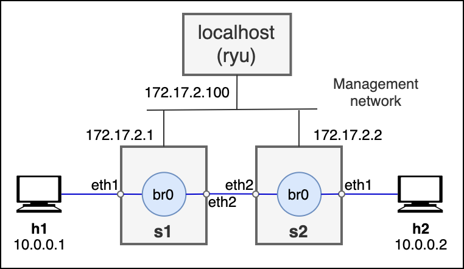

> **RDSV/SDNV**
>
> Curso 2025-26

# QoS con Open vSwitch y Ryu

## Resumen

En esta práctica, se va a utilizar el controlador Ryu para profundizar,
por un lado, en la aplicación de los mecanismos de calidad de servicio
en redes SDN, y por otro, en la utilización de un API REST como interfaz
"Northbound" en la arquitectura SDN.

Para ello se va a desplegar, mediante la herramienta VNX, un entorno de
red sencillo con cuatro sistemas: h1 y h2 que actúan como sistemas
finales, s1 y s2 que actúan como conmutadores OpenFlow. Como se aprecia
en la figura, la topología de la red de datos es en línea: h1-s1-s2-h2.
Asumiremos que la red que une s1 y s2 es una red WAN en la que se
necesita aplicar QoS para hacer frente a la posible congestión de la
red. Los sistemas finales h1 y h2 están configurados en la misma subred
IP 10.0.0.0/24, y por tanto, la función de s1 y s2 será la conmutación
del tráfico a nivel 2. Para ello, s1 y s2 se conectan, a través de la
red de gestión 172.17.2.0/24 al controlador Ryu que se ejecuta
directamente en el sistema Linux local. En Ryu se desplegarán
aplicaciones de red para realizar la conmutación a nivel 2 y para
proporcionar QoS en el tráfico intercambiado entre h1 y h2.



### Referencias

-   GitHub del repositorio del escenario:
    <https://github.com/educaredes/vnx-qos-ryu>

-   Sección QoS de la documentación de Ryu:
    <https://osrg.github.io/ryu-book/en/html/rest_qos.html>

## Creación y arranque del escenario

Solo se puede realizar la práctica en la máquina virtual ya utilizada en
la práctica anterior
([VNXLAB2025-v1.ova](https://idefix.dit.upm.es/download/vnx/vm/VNXLAB2025-v1.ova)).
Recuerde que puede importar esta máquina virtual en cualquier PC con
VirtualBox instalado, ya sea su PC de uso personal o un PC del
laboratorio B-123, usando en este último caso el script:

```shell
/lab/rdsv/bin/get-vnxlab-vm
```

Para más información, vea el apartado "Preparación del entorno" de la
P1.1. Puede acceder remotamente a los PCs del laboratorio utilizando el
servicio accesible a través de <https://acceso.lab.dit.upm.es/>.

Para hacer más legible el análisis de ficheros en formato JSON generados
durante la práctica, se recomienda hacer uso de la herramienta *jq* ya
utilizada en la práctica anterior y disponible en la máquina virtual.
Puede mostrar el contenido de un fichero .json con la herramienta *jq*
tal y como se indica el siguiente ejemplo:

```shell
cat fichero.json | jq
```

Descargue el escenario de la práctica directamente del repositorio en
GitHub y acceda al directorio descargado, por ejemplo, desde la línea de
comandos:

```shell
git clone https://github.com/educaredes/vnx-qos-ryu
cd vnx-qos-ryu
```

Una vez descargado el repositorio puede 
acceder localmente a esta guía en forma de texto "markdown",
haciendo:

```shell
code README.md & 
```

Instale la versión 2.16.0 de la dependencia de Python para Open vSwitch
en la máquina virtual, ejecutando el siguiente comando desde la
terminal:

```shell
pip install ovs==2.16.0
```

A continuación, arranque el controlador ryu en un terminal, especificando las 
aplicaciones que tiene que arrancar.

```shell
ryu-manager ryu.app.rest_qos ryu.app.rest_conf_switch ./qos_simple_switch_13.py
```

En concreto la aplicación `qos_simple_switch_13.py`, cuyo código se proporciona,
es la responsable de implementar un switch de nivel 2 con soporte para QoS.

Abra un nuevo terminal y arranque el escenario de red:

```shell
sudo vnx -f qos-ryu.xml -v -t
```

Para acceder a los terminales de las máquinas que se
despliegan en el escenario de la práctica utilice el usuario *root* y la
contraseña *xxxx.*

>Cuando finalice la práctica puede liberar el escenario con:
>
>```shell
>sudo vnx -f qos-ryu.xml -v -P
>```

## Actividades

### Análisis de la operación de QoS y tablas de flujos OpenFlow

Realice la configuración de QoS que se indica a continuación. Como verá, cada comando (salvo el primero) redirije la salida, en formato json, hacia un fichero para su análisis.  

```shell
curl -X PUT -d '"tcp:172.17.2.2:6632"' http://172.17.2.100:8080/v1.0/conf/switches/0000000000000002/ovsdb_addr
```

```shell
curl -X POST -d '{"port_name": "eth2", "type": "linux-htb", "max_rate": "1000000", "queues": [{"max_rate": "500000"}, {"min_rate": "800000"}]}' http://172.17.2.100:8080/qos/queue/0000000000000002 > queues.json
```

```shell
curl -X POST -d '{"match": {"nw_dst": "10.0.0.1", "nw_proto": "UDP", "udp_dst": "5002"}, "actions":{"queue": "1"}}' http://172.17.2.100:8080/qos/rules/0000000000000002 > match.json
```


```shell
curl -X GET http://172.17.2.100:8080/qos/rules/0000000000000002 > rules.json
```

A continuación, visualice los ficheros con la ayuda de *jq* para
comprobar que las respuestas son las esperadas.

(1) Incluya en formato texto, en el cuerpo de la memoria, las tres
    respuestas JSON.

Después realice las pruebas siguientes de prestaciones entre h1 y h2 para comprobar
que se ha configurado la QoS.

El flujo h2-->h1 usando el puerto 5002 debe estar entre 800 Kbps y 1 Mbps:

```shell
# h1
iperf -s -u -i 1 -p 5002
```

```shell
# h2
iperf -c 10.0.0.1 -p 5002 -u -b 1.2M -l 1200
```

El flujo h2-->h1 usando el puerto 5001 (u otros puertos) debe estar limitado a
500 Kbps:

```shell
# h1
iperf -s -u -i 1 -p 5001
```

```shell
# h2
iperf -c 10.0.0.1 -p 5001 -u -b 1.2M -l 1200
```

(2) Describa los resultados de las pruebas de prestaciones con iperf.

A continuación, para facilitar el trabajo en s2 se recomienda abrir una
sesión SSH a esa máquina:

```shell 
ssh root@172.17.2.2
```

Realice el siguiente análisis usando los comando indicados.

Acceda a s2 y obtenga su tabla de flujos utilizando el comando:

```shell
# s2
ovs-ofctl dump-flows br0 > flujos-s2.txt
```

(3) Identifique en la tabla de flujos la información relacionada con la
    QoS especificada (entradas con las acciones "resubmit (,1)").
    Explique la relación entre esas entradas y la QoS obtenida en las
    pruebas con iperf en cada uno de los puertos 5001 y 5002. Adjunte el
    fichero flujos-s2.txt como parte de la entrega.

De nuevo desde s2, acceda a las estadísticas de las colas, guardando el
resultado en un fichero colas.txt, utilizando el comando:

```shell
# s2
ovs-ofctl -O OpenFlow13 queue-stats br0 > colas.txt
```

Visualice el fichero resultado, y a continuación:

-   Repita la prueba de iperf en el puerto 5001 y acceda de nuevo a las
    estadísticas de las colas, guardando el resultado en un fichero
    colas5001.txt

-   Repita la prueba de iperf en el puerto 5002 y acceda de nuevo a las
    estadísticas de las colas, guardando el resultado en un fichero
    colas5002.txt

(4) Analice las estadísticas obtenidas en estas pruebas, explicando los
    resultados obtenidos. Adjunte los ficheros como parte de la entrega.

Pruebe también los comandos:
```shell
# s2
ovs-vsctl list qos
```

```shell
# s2
ovs-vsctl list queue <queue_id>
```

### Configuración de nuevos flujos con QoS

Configure a continuación la QoS en el sentido de h1 a h2 una tasa global
para la interfaz de s1 a s2 de 2 Mbps, una cola 0 con tasa máxima de 1.2
Mbps y una cola 1 con tasa mínima de 1.7 Mbps. Asigne a la cola 1 el
flujo con destino h2 y puerto UDP 5004, y utilice los puertos 5003 y
5004 para las pruebas con iperf.

(5) Incluya en la memoria los comandos curl utilizados y las respuestas
    json obtenidas.

(6) Utilice los comandos `ovs-vsctl list qos` y `ovs-vsctl list queue
    \<queue_id\>` para comprobar la configuración de s1 e incluya el
    resultado de esos comandos en la memoria.

(7) Incluya los comandos iperf utilizados para las pruebas en h1 y h2 y
    describa los resultados obtenidos.

(8) Obtenga un fichero flujos-s1.txt con el volcado de las tablas de
    flujo de s1 y adjúntelo como parte de la entrega.

## Entrega

Tiene que entregar a través del Moodle un fichero ZIP que incluya el
siguiente contenido:

-   Un documento PDF donde se respondan las cuestiones 1, 2, 3, 4, 5, 6
    y 7.

-   Los ficheros solicitados en las cuestiones 3 (flujos-s2.txt), 4
    (colas.txt, colas5001.txt, colas5002.txt) y 8 (flujos-s1.txt).
